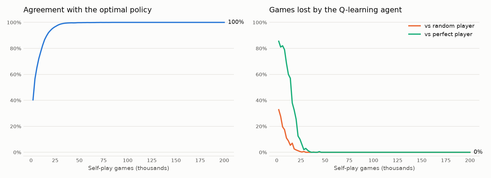

# Tic-Tac-Toe as an MDP: Value Iteration vs Q-Learning

Two ways for a computer to master tic-tac-toe, written from scratch in plain Python:

1. **Value iteration** knows the rules and *plans*: it solves the game exactly with the Bellman equation.
2. **Q-learning** knows nothing in advance and *learns*: it plays against itself and improves from the results.

Value iteration provides the ground truth, so the Q-learning agent can be checked move by move. After 84,000 self-play games (a few seconds of training) it picks an optimal move in **all 4,520 positions** where a move can be made, so it can no longer lose to anyone.

<picture>
  <source media="(prefers-color-scheme: dark)" srcset="assets/learning_curve_dark.png">
  
</picture>

## Try it

```bash
git clone https://github.com/Berekety1/tic-tac-toe-rl.git
cd tic-tac-toe-rl

python play.py                     # play against the perfect agent (you are X)
python play.py --as O              # let the computer move first
python play.py --agent qlearning   # play against the self-taught agent
```

The game itself needs only the Python standard library. To retrain, redraw the plot and run the tests:

```bash
pip install -r requirements.txt
python train.py
python -m pytest
```

## How it works

### The game as an MDP

- **States:** every board reachable from the empty board, **5,478** in total. X always moves first, so whose turn it is follows from the board.
- **Actions:** the empty cells.
- **Reward:** +1 for the move that completes three in a row, 0 for every other move.
- **Discount:** γ = 0.9, so a quick win is worth more than a slow one.

Tic-tac-toe has two players, so every value is measured from the side of the **player to move**. After my move it is my opponent's turn, and because the game is zero-sum, their gain is my loss. The Bellman optimality equation then becomes:

$$V(s) = \max_a \Big[ R(s,a) - \gamma \, V(s') \Big], \qquad V(\text{terminal}) = 0$$

where $s'$ is the board after move $a$. The minus sign is the only change from the single-agent version, and it turns the equation into minimax.

### Value iteration ([`tictactoe/solver.py`](tictactoe/solver.py))

Start with $V = 0$ for every state, then repeatedly apply the equation above to all 5,478 states at once until nothing changes. Values travel backwards from the final positions, and the table **converges after 6 sweeps (about 0.15 s)**.

Results:

- $V(\text{empty board}) = 0$: with perfect play from both sides, tic-tac-toe is a draw.
- **All 9 opening moves are optimal.** A corner, an edge or the centre all lead to a draw against a perfect opponent.

### Q-learning ([`tictactoe/qlearning.py`](tictactoe/qlearning.py))

The agent stores a value $Q(s,a)$ for every state and move it has seen, and updates it after every move it plays:

$$Q(s,a) \leftarrow Q(s,a) + \alpha \Big[ R(s,a) - \gamma \max_{a'} Q(s',a') - Q(s,a) \Big]$$

- Both X and O read and write **one shared table** (self-play), each from its own point of view.
- Moves are chosen **ε-greedily**: ε starts at 1.0 (fully random) and decays linearly to 0.05 over the first 80% of training.
- Settings: α = 0.5, γ = 0.9, 200,000 games, seed 0.

### Evaluation ([`train.py`](train.py))

Every 2,000 games the agent is tested without exploration on:

- **Policy agreement:** in how many of the 4,520 non-terminal positions its greedy move is one of the optimal moves found by value iteration
- **Loss rate** over 500 games against a random player and 200 games against the perfect player, with the agent playing X in half of them

## Results

| Agent | Opponent | Win | Draw | Loss |
|---|---|---|---|---|
| Value iteration | Random | 87.8% | 12.2% | 0.0% |
| Value iteration | Value iteration | 0.0% | 100.0% | 0.0% |
| Q-learning | Random | 86.4% | 13.7% | 0.0% |
| Q-learning | Value iteration | 0.0% | 100.0% | 0.0% |

*2,000 games per row. Q-learning results are after 200,000 training games. Draw rates against the random player differ slightly because ties between equally good moves are broken at random.*

How fast Q-learning got there:

| Self-play games | Policy agreement | Loss vs random | Loss vs perfect |
|---:|---:|---:|---:|
| 10,000 | 77.4% | 11.0% | 68.5% |
| 20,000 | 93.8% | 1.8% | 25.5% |
| 30,000 | 98.6% | 0.0% | 3.0% |
| 40,000 | 99.6% | 0.0% | 0.0% |
| 84,000 | 100% (4,520 / 4,520) | 0.0% | 0.0% |

## Project structure

```
tictactoe/
  board.py       game rules: states, legal moves, winner, rewards
  solver.py      value iteration (exact solution)
  qlearning.py   tabular Q-learning with self-play
  agents.py      random, value-iteration and Q-learning players, plus evaluation
play.py          play against the computer in the terminal
train.py         train Q-learning, compare it with value iteration, draw the learning curve
tests/           tests for the rules, the solver and the learning agent
```

## Possible next steps

- Use board symmetries (8 rotations and reflections) to shrink the state space and speed up learning
- Swap the Q-table for a small neural network (DQN) and test it on larger boards such as 4×4 or Connect Four, where tables no longer fit
